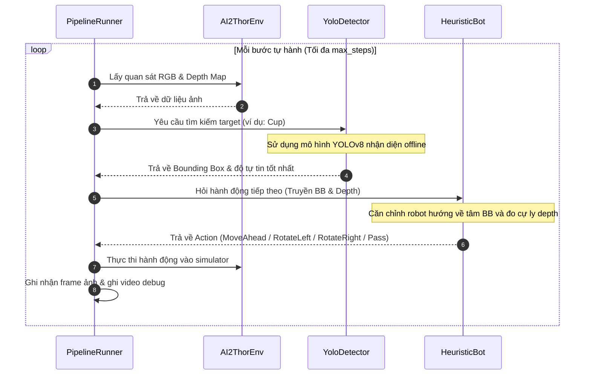

# End-to-End ObjectNav (AI2-THOR + YOLOv8)

Dự án phát triển robot tự hành thực hiện nhiệm vụ Tìm kiếm Vật thể (Object Navigation - ObjectNav) trong môi trường giả lập 3D AI2-THOR, tích hợp bộ nhận diện vật thể YOLOv8 và bộ định hướng Heuristic (luật quyết định căn chỉnh góc độ và khoảng cách dựa trên Depth Map).

---

## 📐 Kiến trúc Hệ thống (System Architecture)

Hệ thống hoạt động theo một vòng lặp khép kín (closed-loop) điều phối bởi `PipelineRunner` kết nối các khối chính sau:

```mermaid
graph TD
    subgraph Closed Loop System
        AI2ThorEnv["AI2ThorEnv (Environment)<br/>Xuất ảnh: RGB & Depth Map"]
        YoloDetector["YoloDetector (Perception)<br/>Xử lý ảnh offline bằng trọng số yolov8n.pt<br/>Xuất: Bounding Box & Confidence Score"]
        HeuristicBot["HeuristicBot (Decision Agent)<br/>Tính toán góc lệch tâm & khoảng cách (Depth)<br/>Xuất: Hành động (Action)"]
        PipelineRunner["PipelineRunner (Closed-loop Orchestrator)<br/>Điều phối luồng dữ liệu & Lưu ảnh/video debug"]
    end

    %% Data Flow
    AI2ThorEnv -->|1. RGB & Depth Map| PipelineRunner
    PipelineRunner -->|2. RGB Frame & Target Name| YoloDetector
    YoloDetector -->|3. Best Bounding Box & Confidence| PipelineRunner
    PipelineRunner -->|4. Query Next Action| HeuristicBot
    HeuristicBot -->|5. Decides Action| PipelineRunner
    PipelineRunner -->|6. Execute Control Action (Move/Rotate)| AI2ThorEnv
```

### Quy trình hoạt động của từng bước (Sequence Diagram)


---

## 🛠️ Hướng dẫn Cài đặt (Setup Instructions)

### 1. Khởi tạo môi trường ảo (Virtual Environment)
Khuyến khích sử dụng Conda hoặc virtualenv để tránh xung đột thư viện:

```bash
# Sử dụng Conda
conda create -n ai_workspace python=3.11 -y
conda activate ai_workspace

# Hoặc sử dụng venv
python -m venv venv
source venv/bin/activate  # Trên Linux/macOS
# venv\Scripts\activate  # Trên Windows
```

### 2. Cài đặt các thư viện từ requirements.txt
Cài đặt toàn bộ các thư viện cần thiết, đặc biệt là `ai2thor` (simulator 3D), `ultralytics` (YOLOv8), và `opencv-python` (xử lý ảnh/video):

```bash
pip install -r requirements.txt
```

---

## 🚀 Hướng dẫn Chạy thử nghiệm (Run Instructions)

Trong lần chạy đầu tiên, hệ thống sẽ thực hiện các cơ chế tải tự động sau:
- **Tải tài nguyên AI2-THOR**: Trình giả lập sẽ tự động tải các tài nguyên môi trường 3D (khoảng 700MB+) và lưu vào bộ nhớ cache. Quá trình này có thể mất vài phút tùy vào tốc độ mạng.
- **Tải trọng số YOLOv8**: Thư viện `ultralytics` sẽ tự động tải file trọng số YOLOv8n (`yolov8n.pt`) từ máy chủ Hugging Face/Ultralytics về thư mục cục bộ của bạn.

### Các câu lệnh chạy mẫu qua CLI (Sample Queries)

1. **Chạy mặc định để tìm kiếm chiếc cốc (`Cup`)**:
   ```bash
   python main.py --target Cup
   ```

2. **Chạy tìm kiếm quả táo (`Apple`) với giới hạn tối đa 50 bước di chuyển**:
   ```bash
   python main.py --target Apple --max-steps 50
   ```

3. **Chạy sử dụng mô hình VLM (Vision-Language Model) qua Hugging Face API**:
   ```bash
   python main.py --detector vlm --target chair
   ```

*Sau khi chạy, kết quả hình ảnh từng bước và video hành trình tự hành (`episode.mp4`) sẽ được lưu tự động tại thư mục `data/test_images/`.*

---

## 🧪 Minh chứng Thử nghiệm (Evaluation Evidences)

Dưới đây là các hình ảnh minh chứng tương ứng với 5 kịch bản kiểm thử (Test Cases) trong quá trình vận hành robot:

1. **Test Case 1: Tìm vật thể có kích thước lớn**
   - **Mô tả**: Robot nhận diện thành công chiếc lò vi sóng (`microwave`) với kích thước box rõ nét và độ tự tin cao ($0.95$).
   - **Minh chứng**: [tc1_large_object.png](file:///home/dat-tufdash/document/AI_20K/project_VLM/github/eval_evidences/tc1_large_object.png) (sao chép từ `step_010.png`)

2. **Test Case 2: Tìm vật thể có kích thước nhỏ**
   - **Mô tả**: Robot phát hiện bình hoa (`vase`) có kích thước nhỏ ở khoảng cách xa trong phòng.
   - **Minh chứng**: [tc2_small_object.png](file:///home/dat-tufdash/document/AI_20K/project_VLM/github/eval_evidences/tc2_small_object.png) (sao chép từ `step_018.png`)

3. **Test Case 3: Logic dò tìm mù (Blind Search)**
   - **Mô tả**: Tại thời điểm xuất phát, mục tiêu nằm ở góc khuất phía sau. Robot tự động quay hướng để quét tìm vật thể và phát hiện ra bàn ăn và cây cảnh sau 7 bước xoay.
   - **Minh chứng**: [tc3_blind_search.png](file:///home/dat-tufdash/document/AI_20K/project_VLM/github/eval_evidences/tc3_blind_search.png) (sao chép từ `step_004.png`)

4. **Test Case 4: Xử lý góc khuất một phần (Occlusion)**
   - **Mô tả**: Chiếc lò vi sóng bị che khuất một phần bởi góc tường, YOLO vẫn nhận dạng được với độ tự tin thấp hơn ($0.60$).
   - **Minh chứng**: [tc4_partially_occluded.png](file:///home/dat-tufdash/document/AI_20K/project_VLM/github/eval_evidences/tc4_partially_occluded.png) (sao chép từ `step_014.png`)

5. **Test Case 5: Xử lý gỡ kẹt & tránh vật cản (Obstacle Avoidance)**
   - **Mô tả**: Robot tiến sát vào vách tường/lò vi sóng, kích hoạt cảnh báo vật cản ở cự ly gần ($0.59$m) trên Depth Map và tự hành xoay phải để gỡ kẹt.
   - **Minh chứng**: [tc5_obstacle_avoidance.png](file:///home/dat-tufdash/document/AI_20K/project_VLM/github/eval_evidences/tc5_obstacle_avoidance.png) (sao chép từ `step_002.png`)

